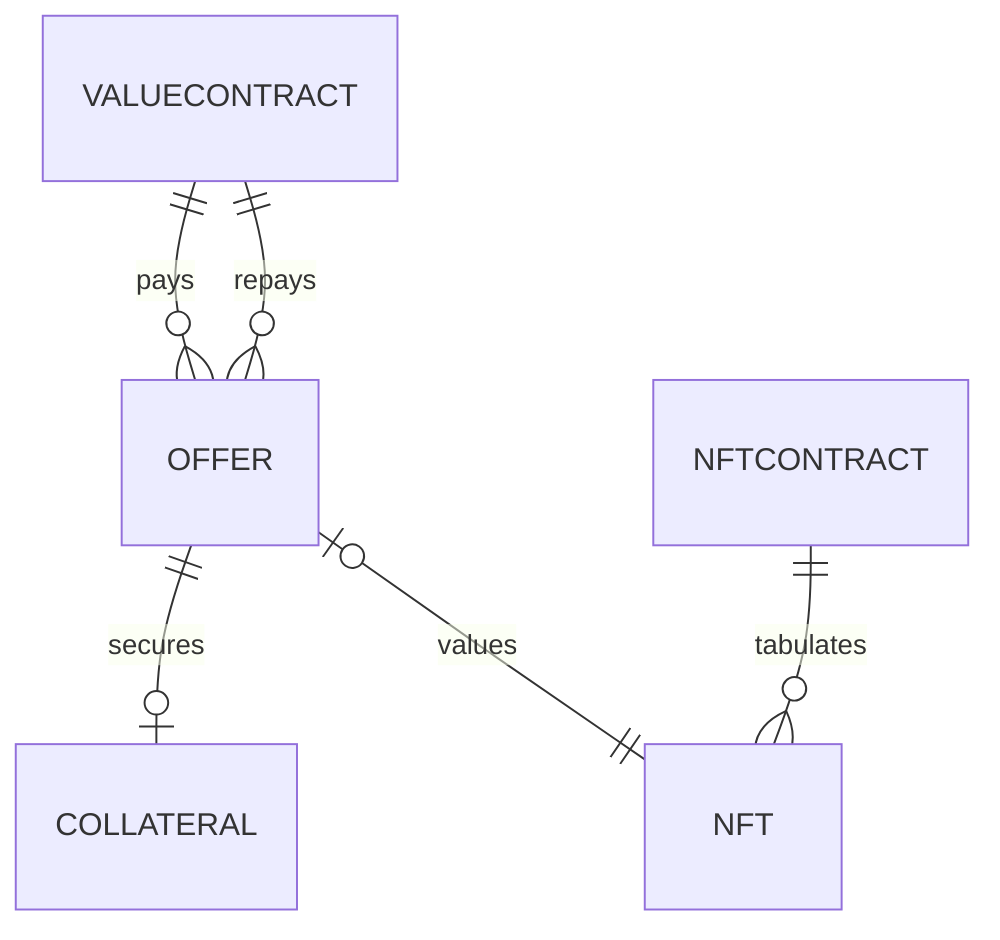

## Notes

* Store Ethereum addresses like "0x239843749" using `VARCHAR(22)`
* Store UINT256 values like "23498734897" using `VARCHAR(71)`
* Store hexadecimal 256-bit values (like transaction hashes) using `VARCHAR(64)`
* Store Unix times as BIGINT // see https://stackoverflow.com/a/59460086/300224 for why to use BIGINT here, if using MySQL
* All columns are NOT NULL unless specified otherwise



## :minidisc: offers

These are every offer that can be executed on the network.

These are inserted using `POST api.nfpawn.io/offer-list`. A cron job removes offers that are expired, if no dependent buyback offers are active.

| Name             | Type                       | Notes                                                        |
| ---------------- | -------------------------- | ------------------------------------------------------------ |
| id               | UINT PRIMARY AUTOINCREMENT | Because INNODB requires a PRIMARY AUTOINCREMENT integer field, or else INSERT will be slow |
| offeror          | VARCHAR(22)                | The Ethereum address of the offeror, like "0x239437493749837..." |
| expiration       | BIGINT                     | The Unix timestamp that this expiration expires // see https://stackoverflow.com/a/59460086/300224 for why to use BIGINT here, if using MySQL |
| term             | BIGINT                     | The number of seconds after a sale that the return offer is valid |
| nftRowId         | UINT                       | FOREIGN KEY: `nfts.id`                                       |
| saleContractId   | UINT                       | FOREIGN KEY: `valueContracts.id`                             |
| saleAmount       | VARCHAR(71)                | The offered sale amount stored in base-10 (accepts up to 2^256-1) |
| returnContractId | UINT                       | FOREIGN KEY: `valueContracts.id`                             |
| returnAmount     | VARCHAR(71)                | The offered return amount stored in base-10 (accepts up to 2^256-1) |
| signatureR       |                            |                                                              |
| signatureS       |                            |                                                              |
| signatureV       |                            |                                                              |
| merkleProof      | BLOB                       | See below...                                                 |

| Key  | Notes |
| ---- | ----- |
|      |       |
|      |       |
|      |       |

The merkleProof is a concatenated array of 256-bit values such that must be set such that `offerer` equals:

* ECRECOVER(...)

  * signatureR
  * signatureS
  * signatureV
  * HASH(...)
    * merkleProof[7]
    * HASH(...)
      * merkleProof[6]
      * HASH(...)
        * ...
          * HASH(...)
            * expiration
            * term
            * nftContract
            * nftId
            * saleContract
            * saleAmount
            * returnContract
            * returnAmount

  ... where the order of the HASH arguments are alphabetical.

## :minidisc: collaterals

After a sale has completed then a buyback offer is active. Rows are added to this table by a cron job that listens for sale events on the smart contract.

| Name              | Type                       | Notes                                                        |
| ----------------- | -------------------------- | ------------------------------------------------------------ |
| id                | UINT PRIMARY AUTOINCREMENT | Because INNODB requires a PRIMARY AUTOINCREMENT integer field, or else INSERT will be slow |
| offerId           | BIGINT                     | FOREIGN KEY: `offers.id`                                     |
| transactionHash   | VARCHAR(64)                | The transaction hash on the network                          |
| buybackExpiration | BIGINT                     | The Unix timestamp that the buyback offer expires            |

## :minidisc:  nftContracts

| Name                | Type                                     | Notes                                                        |
| ------------------- | ---------------------------------------- | ------------------------------------------------------------ |
| id                  | UINT PRIMARY AUTOINCREMENT               | Because INNODB requires a PRIMARY AUTOINCREMENT integer field, or else INSERT will be slow |
| account             | VARCHAR(22)                              | The Ethereum address of the contract, like "0x239437493749837..." |
| pretty              | VARCHAR(100) IS NULL                     | Like "CryptoKitties"                                         |
| tokenPrettyTemplate | VARCHAR(100) IS NULL                     | A way to name each token prettily, like "Kitty: %d" or "Su Square #%5d". This templating language might get get more complicated as needs arise. Or possibly, exclude this column and calculate only on the api server as selected. |
| status              | ENUM("Supported","Blocklisted")  IS NULL |                                                              |
| syncedUpTo          | BIGINT                                   | Highest block number which is fully processed here           |

| Key              | Notes |
| ---------------- | ----- |
| UNIQUE(contract) |       |
|                  |       |
|                  |       |

This table is manually updated for contracts we would like to support. Also, rows could be inserted if an offer is created and that contract is not in here yet.

## :minidisc:  valueContracts

| Name                    | Type                                     | Notes                                                        |
| ----------------------- | ---------------------------------------- | ------------------------------------------------------------ |
| id                      | UINT PRIMARY AUTOINCREMENT               | Because INNODB requires a PRIMARY AUTOINCREMENT integer field, or else INSERT will be slow |
| account                 | VARCHAR(22)                              | The Ethereum address of the contract, like "0x239437493749837..." |
| decimals                | UINT8                                    | Number of decimals places (ERC20.decimals())                 |
| pretty                  | VARCHAR(100)                             | Like "WETH"                                                  |
| status                  | ENUM("Supported","Blocklisted")  IS NULL |                                                              |
| approximatePrice        | DECIMAL(71,18)                           | The bid/ask median for trading this value contract to USD (get this from Compound) |
| approximatePriceUpdated | BIGINT                                   | Unix time (in real life) when approximatePrice was updated   |

| Key  | Notes |
| ---- | ----- |
|      |       |
|      |       |
|      |       |

This table is manually updated for contracts we would like to support.

## :minidisc:  nfts

This is every NFT for every contract that we care about.

| Name          | Type                       | Notes                                                        |
| ------------- | -------------------------- | ------------------------------------------------------------ |
| id            | UINT PRIMARY AUTOINCREMENT | Because INNODB requires a PRIMARY AUTOINCREMENT integer field, or else INSERT will be slow |
| nftContractId | UINT                       | FOREIGN KEY: `nftContracts.id`                               |
| nftId         | VARCHAR(71)                | The NFT token ID stored in base-10 (accepts up to 2^256-1)   |
| pretty        | VARCHAR(100) IS NULL       | Text like "Kitty #239487". Null if we do not know how to pretify names for this contract. Or possibly, exclude this column and calculate only on the api server as selected. |
| imageUri      | VARCHAR(200) IS NULL       | A URL for the image for this NFT                             |
| owner         | VARCHAR(22)                | The Ethereum address of the owner, like "0x239437493749837..." |
| updated       | TIMESTAMP                  | Automatically set by database when rows are inserted or reaffirmed |

| Key                                | Notes                                  |
| ---------------------------------- | -------------------------------------- |
| UNIQUE(nftContractId, nftId)       |                                        |
| INDEX(owner, nftContractId, nftId) |                                        |
| INDEX(updated)                     | Find old items that need to be updated |

This table is updated by a cron job. By caching these values it allows our RSS feeds and web pages to load fast!

## Queries

Prepare data for `GET offers/0x23948739847239847.json`.

```sql
SELECT nftContracts.account
     , nfts.nftId
     , COALESCE(nfts.pretty, CONCAT(nftContracts.account, "/", nfts.nftId)
     , nfts.imageUri
     , offers.expiration
     , offers.term
     , saleContracts.account
     , saleContracts.pretty
     , offers.saleAmount
     , returnContrats.account
     , returnContracts.pretty
     , offers.returnAmount
  FROM offers
  JOIN nftContracts
    ON nftContracts.id = offers.nftContractId
  JOIN valueContracts saleContracts
    ON saleContracts.id = offers.saleContractId
  JOIN valueContracts returnContracts
    ON returnContracts.id = offers.returnContractId
  JOIN nfts
    ON nfts.id = offers.nftRowId
 WHERE nfts.owner = ? -- 0x23948739847customerAddress234879
 ORDER BY saleContracts.account = ? DESC -- 0x234987customer'sPreferredValueAccount239487
```

