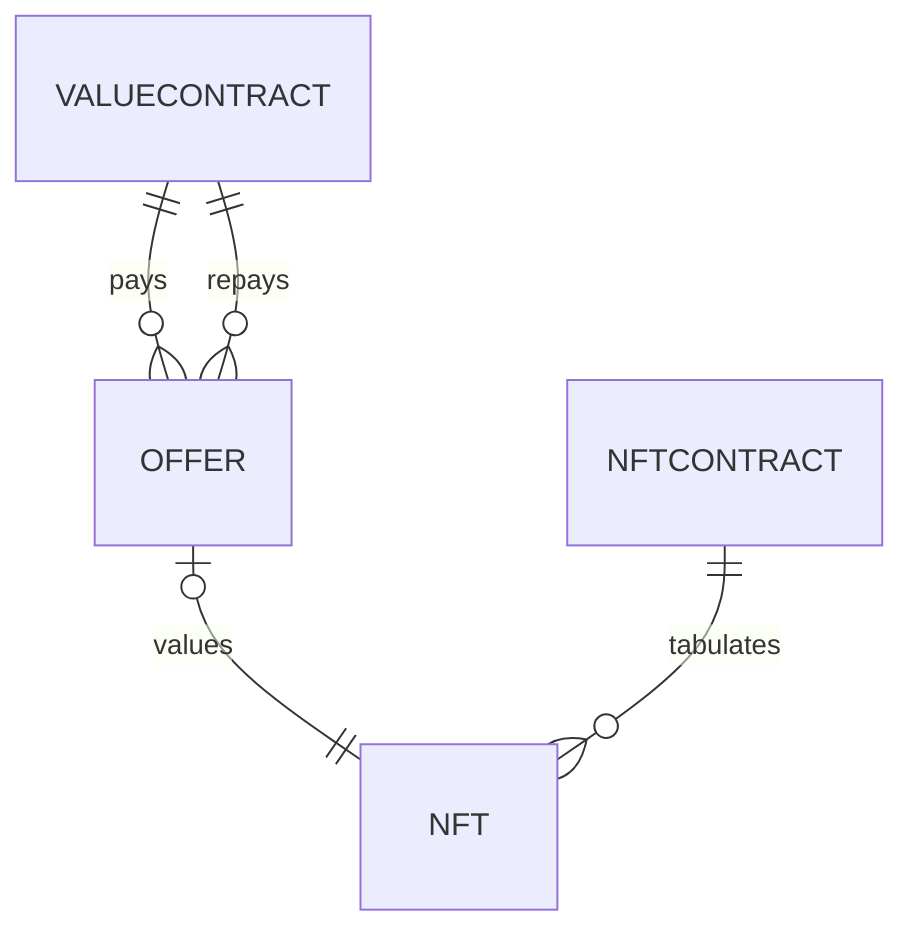

# Database

Here is everything we need to keep in our databases.

## Data type notes

* Store Ethereum addresses as text like `"0x239843749"`
* Store `uint256` values as text like `"23498734897"`
* Store `bytes32` values as text like `"0x47120498740923"`
* Store Unix times as numbers like `523509837450957` see https://stackoverflow.com/a/59460086/300224 for why not to use database time formats
* All columns are NOT NULL unless specified otherwise



## :minidisc: offers

This is every sale-buyback offer that is active or recently closed.

These are every offer that can be executed on the network.

These are inserted using `POST api.nfpawn.io/offer-list`. A cron job removes offers that are expired after 30 days, if no dependent buyback offers are active.

Offer format:

```json
{
  "timeOffered": 298473937404,
  "timeSold": null,
  "timeCollateralAtRisk": null,
  "timeFreeForAll": null,
  "timeBuybackExecuted": null,
  "timeBuybackRevoked": null,
  "liquidator": null,
  "buybackExecutor": null,

  "offeror": "0x92382379487offeror293873947",
  "collateral": {
    "nftContract": LINK_TO_NFTCONTRACT,
    "nftId": "2394837497kittiid234",
    "nftImageUri": "https://storage.googleapis.com/ck-kitty-image/0x06012c8cf97bead5deae237070f9587f8e7a266d/198881.svg",
    "nftOwner": "0x2349374934holder23948723497"
  },
  "sale-offer": {
    "saleExpiration": 234973498734TIME24397349,
    "saleContract": LINK_TO_VALUECONTRACT
    "saleAmount": "24983749374398473493740000000000000000",
  },
  "buyback-offer": {
    "termUntilCollateralAtRisk": 23987394,
    "buybackContract": LINK_TO_VALUECONTRACT
    "buybackAmount": "24983749374398473493740000000000000000",
  },
  "proof": [
    "0x24872104987123049732409327849234",
    "0x23498734093742039487230498237402",
    "0xoeausnthousntoehuesnotuheusntheu"
  ],
  "signature": "0x419827403294341341341htd4nthteod"
}
```

## :minidisc:  nftContracts

Contracts are added as offers come in. Also, we may manually edit these contracts to mark as `$.status = "supported"` or to set the template.

Here is what an nftContract looks like:

```json
{
  "account": "0x23948794837",
  "pretty": "CryptoKitties",
  "tokenPrettyTemplate": "CryptoKitty ${nftIdDecimal}",
  "status": "supported",
  "syncedUpToBlockHeight": 340982375
}
```

### Constraints

* `$.account` must be unique

This table is manually updated for contracts we would like to support. Also, rows could be inserted if an offer is created and that contract is not in here yet.

## :minidisc:  valueContracts

Contracts are added as offers come in. Also, we may manually edit these contracts to mark as `$.status = "supported"` or to set the template.

Here is what a valueContract looks like:

```json
{
  "account": "0x23498374987",
  "decimals": 18,
  "pretty": "WETH",
  "status": "supported",
  "approximatePriceInUSD": "0.000014",
  "approximatePriceInUSDLastUpdated: 23487930894
}
```

### Constraints

* `$.account` must be unique

## :minidisc:  nfts

Here is how an NFT looks:

```json
{
  "contract": LINK_TO_NFTCONTRACT,
  "id": "3405742309574",
  "pretty": "CryptoKitties #198881",
  "imageUri": "https://storage.googleapis.com/ck-kitty-image/0x06012c8cf97bead5deae237070f9587f8e7a266d/198881.svg",
  "owner": "0x2349374934holder23948723497"
}
```

### Constraints

* (`contract`, `id`) must be unique

### Indicies

* It must be fast to look up all NFTs by owner